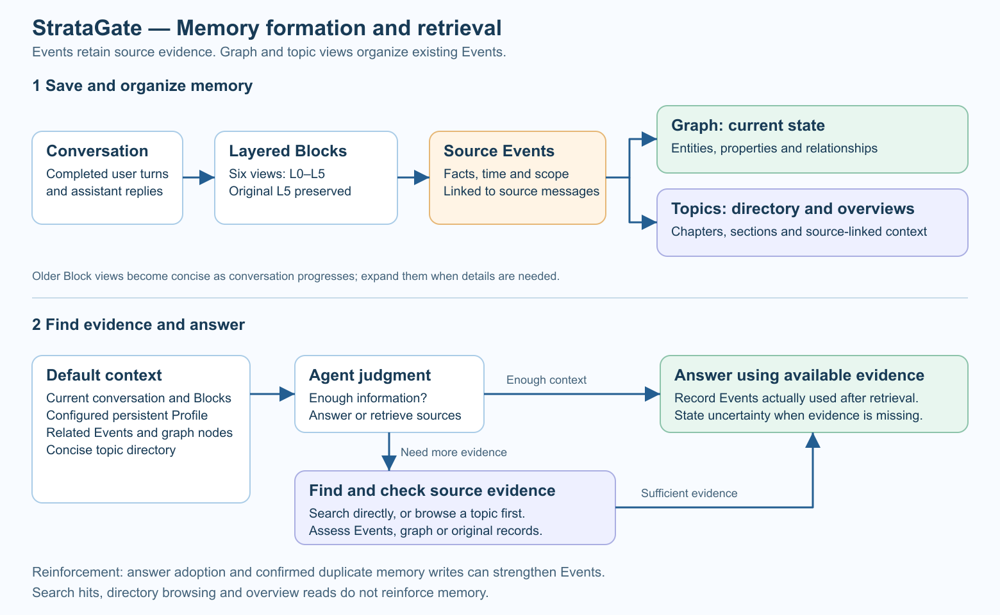
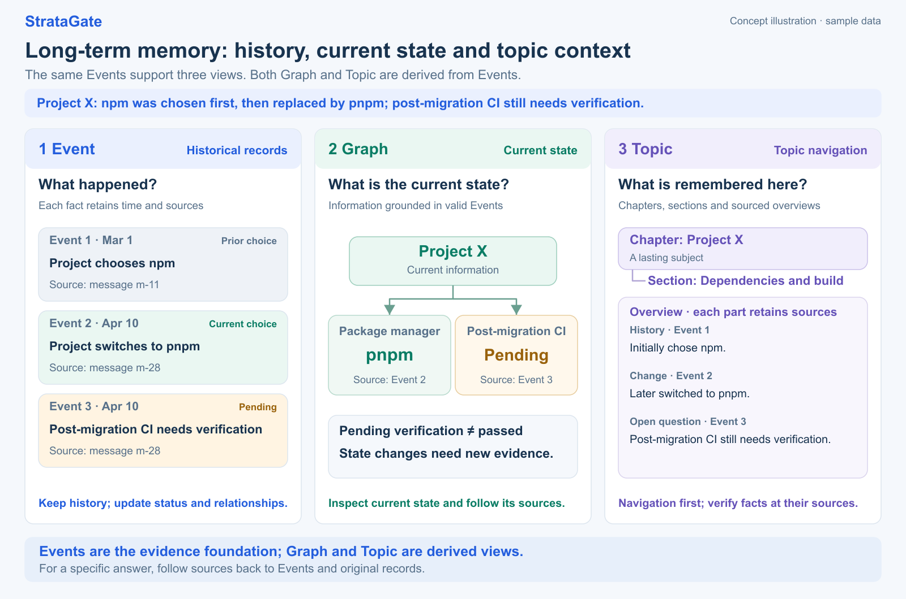

<div align="center">


# StrataGate

### Recent conversations stay detailed. Older memories grow more concise.

StrataGate is a cross-session memory plugin for DeepSeek Harness. Recent conversations stay detailed, older conversations become concise, and original records remain available when needed. Lasting information becomes Events, the knowledge graph represents current state, and the topic directory helps the agent discover what has been remembered and find its sources.

<p align="center">
  <a href="https://github.com/diqierjia/StrataGate-AgentMemory/actions/workflows/ci.yml"></a>
  <a href="https://www.npmjs.com/package/stratagate-dsh"></a>
  <a href="LICENSE"></a>
  <a href="https://github.com/diqierjia/StrataGate-AgentMemory/stargazers"></a>
</p>

[中文说明](README.zh-CN.md) · [DeepSeek Harness guide](docs/DSH.md) · [Architecture](docs/ARCHITECTURE.md) · [Full evaluation](docs/EVALUATION.md)

<strong>Published evaluation:</strong> on 152 questions from one LoCoMo conversation, `conv-26`, each answer received 10 independent evaluations. Mean judged accuracy was <strong>80.46%</strong>, versus <strong>63.22%</strong> for Mem0 base. These results use the R8 evaluation configuration. [See evaluation scope](#experimental-results).

</div>

---

<div align="center">

<h3 align="center">Community &amp; downloads</h3>

<table align="center">
  <tr>
    <td align="center">
      <a href="https://dshfind.com/en/plugins/diqierjia/StrataGate-AgentMemory?ref=badge">
        
      </a>
    </td>
    <td align="center">
      <strong>npm downloads</strong><br /><br />
      <a href="https://www.npmjs.com/package/stratagate-dsh"></a><br />
      <a href="https://www.npmjs.com/package/stratagate-dsh"></a>
    </td>
  </tr>
</table>

<p align="center">
  <a href="https://awesome-dsh-plugin.com"></a>
  <a href="CONTRIBUTING.md"></a>
</p>

</div>

---

## Why StrataGate?

1. **Short-term memory: details fade as the conversation progresses and expand when needed.**

   (1) **Recent history stays detailed; older history becomes concise.** Each conversation block has six views, L0–L5, with different levels of detail. As more conversation accumulates, older memories gradually shift from full dialogue to key facts, short summaries, and title indexes, reducing the context occupied by history. → [Layered memory](#layered-memory)

   (2) **Views shrink while original records remain.** Complete L5 source messages and tool records are preserved. When details need checking, the agent can expand a memory to recover the original wording and context. → [Layered memory](#layered-memory)

   

2. **Long-term memory: Events preserve history, the graph organizes current state, and the topic directory helps find relevant records.**

   (1) **Events record what happened.** Important decisions, preferences, requirements, and changes are extracted from conversations as Events. Each retains its source and distinguishes when something was mentioned from when it happened, so future sessions can retrieve and trace it. → [Event cards](#event-cards)

   (2) **The knowledge graph represents current state.** Historical Events provide the basis for current information and relationships about people, projects, organizations, tools, and places. New Events can supplement or supersede an earlier state while historical Events and their sources remain preserved. → [Current-state graph](#current-state-graph)

   (3) **The topic directory shows what has been remembered.** Related Events are organized into chapters and sections around lasting subjects. The agent can browse the directory and open a topic overview to understand its background, decisions, changes, and open questions, then follow its sources to specific Events. → [Memory directory and topic overviews (Chinese)](docs/MEMORY_TOPICS.zh-CN.md)

   (4) **Long-term weights decay too.** As conversations progress, memories that have not been adopted gradually lose weight, affecting their priority during retrieval and automatic recall. Their sources remain available for verification even after their weights decay. → [Weights and adoption-based reinforcement](#use-only-reinforcement)

   (5) **Bring memories from other AIs.** Imported content can become traceable Events and update the knowledge graph while the original imported text remains preserved. → [External memory import](#external-memory-import)

3. **Evidence gate: check whether retrieved evidence is sufficient before answering.**

   Topic overviews help locate information; answers need verification against source Events or original records. A relevant search result may still be insufficient to answer the question. The agent assesses the evidence and, when needed, searches again or expands the sources. If it still cannot confirm the answer, it states the uncertainty. → [Evidence gate](#evidence-gate)

4. **Retrieval hits do not automatically reinforce memory.**

   Search hits, automatic context injection, and topic browsing do not trigger reinforcement. In the retrieval-use workflow, Events recorded as actually used in the final answer increase the adoption count and reset the decay anchor. More adoptions mean slower future decay. Explicit memory recording can also reinforce an existing record when the information is confirmed as a duplicate. → [Weights and adoption-based reinforcement](#use-only-reinforcement)

Get started: → [Quick start](#quick-start-deepseek-harness)

<a id="quick-start-deepseek-harness"></a>

## Quick start: DeepSeek Harness

If DeepSeek Harness is already installed, add StrataGate to the profile you use:

```bash
dsh plugin --profile web add stratagate-dsh
```

DSH compatibility includes the complete `0.2.0` version family: all Alpha, Beta, RC, and stable releases (`>=0.2.0-0 <0.2.1-0`), alongside the previously supported hosts. A new `0.2.0` prerelease does not require a plugin update just to declare its version.

Restart that profile, then keep using DSH normally. StrataGate will capture completed main-agent turns, build searchable memory in the background, and expose its Memory UI under **DSH Settings → StrataGate-AgentMemory**.

By default, the database is stored at:

```text
DSH_HOME/stratagate/memory.db
```

Removing the plugin does not delete the database. For screenshots, configuration, memory tools, and the exact automatic-capture rules, see the [DeepSeek Harness plugin guide](docs/DSH.md).

The command uses the `web` profile; replace `web` if you use another profile. Developers can go directly to [Development and documentation](#code-entry-points).

<a id="how-stratagate-works"></a>

## How it works



1. **Save conversations.** Several consecutive turns form a memory Block, stored as six views ranging from an index to the original records. Older Blocks display more concise views as the conversation progresses and can expand when details are needed.
2. **Organize lasting information.** Facts, decisions, preferences, and requirements with future value become Events with time, scope, and source references. The graph organizes current state, while the topic directory and overviews organize related Events into chapters and sections.
3. **Recall when answering.** The plugin supplies the active conversation, any configured persistent Profile, a small set of relevant memories, and a concise topic directory. When more information is needed, the agent can search Events, the graph, or original records directly, or browse topics and open an overview before retrieving source Events.
4. **Assess evidence and record actual use.** The agent checks whether explicitly retrieved evidence is sufficient. It searches or expands further when needed, answers using sufficient evidence, and records the Events actually adopted to update their long-term weights.

Automatic recall includes at most **4 Events and 4 graph nodes** within approximately **900 tokens**. The topic directory has a separate budget of approximately **400 tokens**, with category and pagination entries for larger directories. The persistent Profile, layered Blocks, and unsealed turns are supplied separately and are outside those two budgets.

The directory and overviews are built from existing Events in background batches. Reading an existing directory or overview does not itself call a model, create an evidence batch, or reinforce memory. → [Memory directory and topic overviews (Chinese)](docs/MEMORY_TOPICS.zh-CN.md)

## Core design

| Mechanism | What changes | What remains |
| --- | --- | --- |
| Short-term simplification | Which L0–L5 view an older Block displays by default | Original L5 conversations and tool records |
| Long-term weight decay | An Event's priority in later recall | Event history and its sources |

Both follow conversation progress: short-term decay uses ready-Block distance, while long-term decay uses turn distance. Elapsed days alone do not trigger either form of decay.

<a id="layered-memory"></a>

### 1. Short-term memory: gradually condense older conversations and expand them when needed

Recent discussions usually need their full detail. Older conversations can remain in context as concise views. StrataGate stores several levels of detail for the same conversation block and gradually reduces what older Blocks display by default as more conversation accumulates.


**One conversation block, six levels of detail.**

The DeepSeek Harness plugin seals a Block every **6 complete turns** by default. A turn consists of a user question and the assistant's complete response. The Block size is configurable; the core-library default is 12 turns. Content below the boundary remains in the current conversation.

Each fully processed Block contains these views:

| Level | Contents | Primary use |
| --- | --- | --- |
| L0 | Title and tags | Identify a piece of history with minimal context |
| L1 | Short summary | Understand the discussion's topic |
| L2 | Key facts | Review decisions, constraints, plans, and outcomes |
| L3 | Deterministically condensed dialogue | Remove standalone fillers from a fixed allowlist; keep only the first duplicate long or code-like paragraph; retain tool names and result summaries |
| L4 | Near-verbatim dialogue without internal messages | Remove system messages; only trim outer whitespace and add role labels to user and assistant text; retain names and summaries for recognized tool records |
| L5 | Source messages and tool records | Verify provenance and specific details |

The model summarizes L0–L2. Fixed rules generate L3/L4: L3 removes standalone fillers and repeated long content, while L4 stays near-verbatim; both compact recognized tool records. Short-term decay advances with subsequent ready Blocks, not elapsed days.

<details>
<summary>Exact pruning rules, decay formula, and level thresholds</summary>

The model produces L0–L2 summaries. L3 and L4 do not use model paraphrasing; code generates them with these fixed rules:

- **L4:** Remove system messages. User and assistant text is preserved except for trimming outer whitespace and adding `User`, `Assistant`, or other role labels. Recognized structured tool records retain the tool name and a result summary of at most 160 characters while omitting raw `arguments`, `params`, `input`, and `request` fields. Tool-role text that is not recognized as tool JSON remains unchanged.
- **L3:** Condense further without semantic rewriting. A sentence is removed only when, after trailing punctuation is stripped, it exactly matches a fixed filler allowlist such as `ok`, `thanks`, `got it`, `好的`, `明白`, `收到`, `谢谢`, or `可以`. After whitespace normalization and case folding, code-like paragraphs and paragraphs of at least 80 characters are deduplicated: the first copy remains verbatim, and later exact duplicates become an omission marker. Tool records use the same name-and-result-summary form as L4.
- **Length guard:** If generated L4 would be longer than L5, L5 is used instead. If L3 would be longer than L4, L4 is used instead, preserving `L3 ≤ L4 ≤ L5`.

Source records are saved first, followed by summarization and Event processing. Only a fully processed, ready Block can replace its corresponding native history and participate in decay.

**As more conversation accumulates, older Blocks default to less detail.**

Display changes follow exponential decay:

<p align="center"><strong>w<sub>block</sub>(age) = e<sup>−λ<sub>block</sub> · age</sup></strong></p>

The default decay coefficient λ<sub>block</sub> is **0.30**. Code maps weight ranges to display levels. Smaller coefficients preserve detail for longer and therefore consume more context.

In this formula, `age` is the distance between the current display anchor and the latest ready Block in the same conversation. It measures conversation progress, **not elapsed calendar days**. Unsealed turns and Blocks still awaiting model processing do not advance this decay.

For a Block that starts at L5 and is never expanded again, the default schedule is:

| Additional ready Blocks | Default display level |
| ---: | --- |
| 0–1 | L5 |
| 2 | L4 |
| 3–4 | L3 |
| 5–6 | L2 |
| 7–8 | L1 |
| 9 or more | L0 |

The figure illustrates the trend. Actual changes depend on both the decay coefficient and level thresholds; a new Block does not necessarily cause a one-level drop.

</details>

**Expand again when details are needed.**

Suppose an older conversation currently shows only:

> Discussed the project's technical approach and near-term plans.

If the user asks why pnpm was chosen, the agent can expand key facts, condensed dialogue, or the complete source records to find the original reason.

Expansion can proceed one level at a time or jump directly to a requested level. The selected level and current Block position become the new decay anchor. As subsequent conversation accumulates, the view gradually becomes concise again.

Older conversations can therefore remain lightweight during ordinary use while retaining recoverable detail. **L0–L4 are derived views of the source and never overwrite L5.**

<a id="event-cards"></a>

### 2. Long-term memory: Events preserve history, the graph organizes current state, and topics help find relevant records

Short-term memory retains a discussion's context. Long-term memory organizes information with future value. The example below shows a project switching from npm to pnpm and the three views of that change:



**Events record what happened, the graph organizes current state, and topics provide context and navigation.** Both the graph and topics are derived from existing Events. Specific claims still need verification against source Events or original records. The figure uses sample data.

**Events record what happened, with time and source references.**

A Block can produce multiple Events or contain no information that needs extraction. Each Event retains its content, scope, source Block and messages, and any temporal information that can be established.

| Time | Meaning |
| --- | --- |
| Mention time | When the conversation referred to the event |
| Occurrence time | When the event happened or is planned to happen |

If a user says “Finish the prototype next week” on May 6, May 6 is the mention date, while “next week” describes the planned completion time. The record retains its planned status and cannot serve as evidence that the prototype is complete. Uncertain dates retain their original wording and uncertainty.

**The updated extractor pays closer attention to useful user information.**

Explicit requirements, corrections, evaluations, and changed decisions can become Event candidates when they have independent future value. Routine file reads, tool calls, and repeated tests are not recorded one by one merely because they occurred. Confirmed causes, platform limitations, failure conditions, and meaningful outcomes can still be retained.

Extraction must specify scope: a request for one answer stays session-scoped, project requirements belong to the project, and stable user information or explicit lasting guidance can use user scope. For example, “Align the arrows in this image” must not automatically become a permanent aesthetic preference. Missing or invalid scope triggers bounded retries; if no valid result is obtained, that extraction result is not written.

These rules apply to normal extraction after upgrading. They do not replay old conversations or rewrite historical Events. See the [Event extraction guide (Chinese)](docs/event-extractor.md) for the detailed rules.

**New Events supplement, supersede, or flag conflicts while history remains traceable.**

When a project first chooses npm and later switches to pnpm, the earlier decision remains in history and the new Event updates the current choice. “Post-migration CI verification is pending” adds an open question without changing the package manager. Contradictory statements whose validity cannot be resolved retain a conflict for later verification.

New Events do not overwrite earlier content or sources. Validity and relationships can change with new evidence, making it possible to explain what used to be true and what changed.

<a id="current-state-graph"></a>

**The knowledge graph organizes current information and relationships from Events.**

Nodes represent people, projects, organizations, tools, and places. Relationships represent connections such as “uses,” “participates in,” and “depends on.” Attributes and relationships retain their source Events. In the example:

- a question about what the project uses can start with the current graph;
- a question about when it changed can inspect the change Event;
- a question about why it changed can expand the Event and check the original discussion.

Graph state must have source support. In the figure, “uses pnpm” comes from Event ② and “CI verification pending” comes from Event ③. Pending verification does not mean the checks have passed; new evidence must confirm the outcome before the state changes. Failed graph updates can be retried separately while saved Events and original records remain searchable.

<a id="memory-topics"></a>

**The topic directory helps the agent discover available memories and find their sources.**

With clear keywords, the agent can search directly. With only a vague recollection, it can browse the directory first. A Topic is a lasting chapter, such as “Project X” in the figure. Sections hold related categories, such as “Dependencies and build.” Individual versions, bugs, and progress updates sit within sections so each change does not create another chapter.

The directory provides topic names and entry points. On-demand overviews organize background, progress, decisions, changes, and open questions, with Event sources. Content with the same section title is grouped together, and existing chapter and section numbers are kept stable where possible as information is added.

For “Where did we leave the project's technical plan?”, the agent can find the topic, read its overview, then retrieve source Events to verify agreed choices, subsequent changes, and outstanding questions.

**Overviews guide navigation; source records supply evidence for answers.** Directory and overview reads create no evidence batch and do not reinforce memory. To rely on a fact, the agent retrieves Events or expands sources and assesses the evidence. Ordinary Event, graph, and raw-record retrieval remains available when topics have not yet been organized.

See [Memory directory and topic integration (Chinese)](docs/MEMORY_TOPICS.zh-CN.md) for tools and background maintenance.

<a id="persistent-profile"></a>

**Persistent Profile, Event memory, and current requests serve different purposes.**

| User statement | Where it belongs | When it is used |
| --- | --- | --- |
| “Use Chinese by default from now on” | Persistent Profile | Automatically supplied across future sessions after being set |
| “This project has switched to pnpm” | Event memory | Recalled or retrieved for relevant questions |
| “Keep this answer brief” | Current conversation | Applies to this answer without requiring long-term storage |

The word “remember” alone does not determine where information belongs. Explicit Profile update requests can be applied directly. Inferred Profile changes require the agent to state the proposed field and value and obtain user consent. Information worth recalling in relevant situations can also be recorded with the active-memory tool without waiting for a Block to seal.

Location fields distinguish the default location, usual city of residence, and current city. For someone who lives in Harbin but is visiting Beijing, a weather question uses an explicitly specified task location first; otherwise it uses the current city, then the default location. Travel does not automatically overwrite residence, and the current city persists until updated or cleared. See the [plugin guide](docs/DSH.md).

<a id="evidence-gate"></a>

### 3. Evidence gate: check whether retrieved results can answer the actual question

After locating relevant memories, the agent checks whether they support the answer: what is established, what is missing, and whether to answer or search further. Retrieval rank and memory weight are not measures of factual accuracy.

For “Why did we originally switch to pnpm?”:

| Step | Information found | Next action |
| --- | --- | --- |
| Locate the topic | An overview of “Project technology choices” mentions a package-manager change | Follow the sources to specific Events |
| Retrieve the Event | “The project switched from npm to pnpm” | The change is established but its reason is missing; expand the source |
| Check the original text | Example: “Installation is faster, and it better fits our multi-package structure” | Verify the project and time, then explain the reason using this evidence |

The quote is an illustrative example. If the sources do not explain the reason, the agent should state that it cannot confirm it, rather than infer the historical decision from pnpm's general advantages.

The model assesses sufficiency; code checks source references and retrieval constraints. Topic overviews supply navigation clues, while actual adoption must use assessed retrieval evidence. If the existing context is sufficient, additional searches are unnecessary.

Explicit retrieval batches must complete assessment and usage recording before the final answer; unused batches are closed with an empty usage record. If this is omitted, the plugin requests completion first, then a complete user-facing answer, so internal status does not become the final reply. The model can still misjudge evidence; uncertainty should remain explicit when verification is unavailable.

<details>
<summary>Evidence assessment fields and protocol checks</summary>

| Field | What it explains |
| --- | --- |
| `verdict` | Whether evidence is sufficient, partial, or mismatched |
| `evidence_refs` | Which retrieved items support the assessment |
| `fit` | How the evidence matches the question |
| `missing` | What information is still missing |
| `next_strategy` | Whether to answer, search again, or expand a memory |

References must belong to the selected retrieval batch. Accepting `sufficient` requires valid evidence references and an explicit choice to answer. Usage records contain only evidence actually used in the answer, or an empty list when none was used. See the [plugin guide](docs/DSH.md) for interfaces.

</details>

<a id="use-only-reinforcement"></a>

### 4. Retrieval hits do not automatically reinforce memory: repeated adoption means slower future decay

Long-term memories also decay as conversations progress. Here, the changing quantity is an Event's weight, which participates in later recall and ranking. Unlike a short-term Block, an Event does not move through L0–L5 display levels as its weight decays.


An Event not used in answers gradually loses weight as conversation turns accumulate. This can lower its recall priority while its historical record remains available.

**Retrieval does not trigger reinforcement.**

A search hit only establishes possible relevance. The system may record when a memory was retrieved, but retrieval does not increase its adoption count or reset its decay anchor.

Automatic context injection, directory browsing, and overview expansion do not reinforce memories merely by displaying them. This prevents a memory from continually gaining weight just because it happened to rank highly and then appeared repeatedly.

**Recorded adoption after retrieval updates weights.**

After selecting evidence for the final answer, the agent submits a usage receipt. Validated Event selections increase their adoption counts and move their decay anchors to the current turn. An ordinary active Event without an additional weight cap returns to weight 1.

As the adoption count increases, the decay coefficient decreases. The Event retains more weight over the same number of subsequent turns, so memories that repeatedly help answers decay more slowly.

Adoption is based on the agent's submitted evidence selection. Code checks that the evidence belongs to the corresponding batch and has passed a sufficient assessment. Receipts prevent the same operation from being applied twice. Unused results receive no reinforcement from that selection.

**Recording duplicate information can also reinforce an existing memory.**

When `memory_remember` records information, a confirmed exact or near duplicate of an existing agent-recorded memory can reinforce that Event instead of creating another card. This is duplicate handling during a write, distinct from a search hit.

**Different criticality levels have different minimum weights.**

| Memory category | Default minimum weight |
| --- | ---: |
| Routine information | 0 |
| User preference | 0.3 |
| Identity information | 0.9 |
| Safety information | 1.0 |

Pinned memories have an effective weight of 1. Superseded Events normally receive a low weight cap so older states do not retain excessive priority.

These weights express a memory-management policy, not factual accuracy. Even high-weight information must be assessed against the current question, current state, and original source.

<details>
<summary>Long-term weight formula and counters</summary>

**New Events have an initial weight that decays when they are not adopted.**

The base Event-weight function is:

<p align="center"><strong>w(t,n) = max(floor, e<sup>−λ(n)t</sup>)</strong></p>

<p align="center"><strong>λ(n) = 0.15 / (1 + 1.5 ln(n))</strong></p>

Here:

- `t` is the difference between the current turn and the most recent reinforcement anchor; new Events start counting from creation;
- `n` is an internal count, initialized to 1 and incremented by answer adoption or duplicate confirmation during active-memory recording; retrieval alone does not increment it;
- `floor` is the minimum weight assigned according to the memory's criticality.

Long-term decay also uses conversation turns rather than elapsed wall-clock time. Lower weight may reduce a memory's priority in later recall, but decay does not delete its historical record.

</details>

<a id="external-memory-import"></a>

## Import memory from another AI

Import a memory summary exported by another AI. StrataGate turns lasting information into Events, compares it with existing memories, and keeps the imported text for source tracing.

The DSH UI previews the import. Duplicates can be ignored; changes can add, merge, or supersede information, and unresolved differences can be marked as conflicts. Low-confidence decisions allow manual selection, and committed batches can be undone. Earlier Events and their sources remain available.

See the [external-memory import guide](docs/EXTERNAL_MEMORY_IMPORT.zh-CN.md) for formats, prompts, and integration examples.

## A real retrieval path

One LoCoMo question asks when Caroline gave a speech at a school:

1. Event search finds the “school speech” card, but it lacks the date.
2. The agent judges the evidence partial, identifies the missing date, and searches source messages.
3. It finds a message dated 2023-06-09 containing “last week.”
4. The message timestamp gives context for “last week,” providing enough temporal evidence to answer.

The Event helps locate the discussion, and the original message and timestamp support verification. The evidence gate requires the agent to identify the gap and keep checking.

<a id="experimental-results"></a>

## Evaluation results and limits

The repository's published R8 comparison uses the LoCoMo conversation sample `conv-26`, containing **419 messages, 35 sessions, and 152 questions** across categories 1–4.

**The scores below describe the published R8 experiment, not a dedicated evaluation of the 0.3.0 topic directory or the 0.3.2 Event extractor.** They do not establish those updates' accuracy, cost changes, or independent benefits.

Each system generated answers, and each answer received **10 independent Judge evaluations**. These are repeated evaluations, not ten complete system runs.

| Metric | StrataGate | Mem0 base | Difference |
| --- | ---: | ---: | ---: |
| Mean accuracy across 10 Judge runs | **80.46%** | 63.22% | **+17.24 percentage points** |
| Majority-correct | **121 / 152 (79.61%)** | 96 / 152 (63.16%) | **+25 questions** |
| Temporal | **74.86%** | 34.59% | **+40.27 percentage points** |
| Single-hop | **89.29%** | 75.14% | **+14.14 percentage points** |
| Multi-hop | **66.56%** | 61.56% | +5.00 percentage points |
| Open-domain | 83.08% | **84.62%** | -1.54 percentage points |

Both systems used the same questions, order, answer model, Judge model, evaluation prompt, parser, and evaluation count, and each rebuilt its memory. Memory extraction, retrieval implementation, embedding use, and answer context differed, so this compares two complete system configurations.

These results cover only `conv-26`, not the full LoCoMo dataset. They do not isolate the benefits of short-term decay, the knowledge graph, or the evidence gate. Individual contributions still require ablation experiments.

See the [evaluation document](docs/EVALUATION.md) for the full protocol, per-question results, and Judge variation, and the [machine-readable results](benchmarks/locomo-conv26-r8-final.json) for summary data.

In the R8 evaluation above, **31 questions were judged incorrect by a majority of evaluators**. Grouped by the observable failure stage:

| Failure stage | Questions | What it indicates |
| --- | ---: | --- |
| Incorrect direct answer without retrieval | 15 | The agent sometimes failed to recognize that historical evidence was needed |
| Evidence judged sufficient, but the final answer was incorrect | 14 | Evidence could concern a neighboring event or fail to support the complete answer |
| Evidence remained insufficient at the retrieval budget | 2 | Enough information was not found within the allotted budget |

Within this evaluation, the results point to a need to improve when retrieval starts and whether retrieved evidence actually answers the question. The evidence gate constrains references and assessment procedures, but cannot guarantee the model's semantic judgment or final answer.

See the [full evaluation](docs/EVALUATION.md) for R1–R8 design history, per-question analysis, and further validation.

## Scope and costs

**Memory spaces determine which conversations share memories.** DSH defaults to project isolation based on the working directory. Session isolation and a shared global space are also available. Topics expose only visible Events in the current space; the persistent Profile is supplied across sessions and memory spaces. See the [plugin guide](docs/DSH.md) for configuration.

**Context budgets are not the total model cost.** Automatic recall and the topic directory have separate budgets. The persistent Profile, layered Blocks, unsealed conversation, and subsequent active retrieval are supplied separately. The 900-token recall budget and 400-token directory budget do not sum to a fixed size for the entire request.

| Stage | Does it call a model? | Where costs arise |
| --- | --- | --- |
| Background summaries, Event extraction, graph, topic and Profile organization | Yes | Conversation, Event or Profile inputs, generated outputs, and bounded retries |
| Reading an existing directory, overview, or stored search results | The read itself does not | Results still consume tokens when included in a later model request |
| Agent evidence assessment and answer generation | Yes | Current context, retrieved evidence, and generated answers |

Layered views reduce the history included by default when answering. For tool-heavy conversations, background derivation compacts code and oversized tool traces in model inputs while complete records remain in L5. Assess total cost from actual background, retrieval, and answer usage; smaller context alone does not establish savings.

**Historical topics appear progressively after upgrading.** Existing Events are organized in background batches, so the directory may initially be incomplete. New or changed Events receive priority. Failed or pending organization retains Event entry points and ordinary retrieval remains available. Historical work uses a shared database-wide allowance, bounded retries, and restart recovery; it does not promise a fixed cost. See [topic maintenance (Chinese)](docs/MEMORY_TOPICS.zh-CN.md) for limits and recovery.

Directories and overviews can be rebuilt from valid sources. When a source changes, is forgotten, or is archived, outdated derived content is hidden before background rebuilding. Updated extraction rules apply to subsequent normal extraction rather than rewriting all historical Events. Functional tests check these workflows and constraints; extraction, categorization, and evidence judgment still depend on the model.

<a id="code-entry-points"></a>

## Development and documentation

This section is for developers. DeepSeek Harness users can follow the [quick start](#quick-start-deepseek-harness) without building the repository themselves.

The development environment requires:

- Node.js **22.19.0 or later within the 22.x series**, or **24.0.0 or later**;
- the declared version range is `^22.19.0 || >=24.0.0`.

After checking out the repository, run these commands from its root:

```bash
npm install
npm run check
npm test
npm run build
```

| Resource | Contents |
| --- | --- |
| [DeepSeek Harness guide](docs/DSH.md) | Installation, configuration, UI, memory tools, and recovery |
| [Memory directory and topic overviews (Chinese)](docs/MEMORY_TOPICS.zh-CN.md) | Chapters and sections, source tracing, background organization, budgets, and recovery |
| [Event extraction rules (Chinese)](docs/event-extractor.md) | Extraction decisions, scope, duplicates and historical relationships, and compatibility |
| [Architecture](docs/ARCHITECTURE.md) | Layering, Events and graph, retrieval, evidence gate, weights, storage, and core APIs |
| [External-memory import](docs/EXTERNAL_MEMORY_IMPORT.zh-CN.md) | Export format, import flow, and integration example |
| [Full evaluation](docs/EVALUATION.md) | Protocol, version history, failure analysis, and result scope |
| [Evaluation summary data](benchmarks/locomo-conv26-r8-final.json) | Published results, statistics, and artifact information |
| [Core-engine example](packages/core/examples/basic.ts) | Minimal API integration example |

The core implementation is in `packages/core/`; the DSH adapter is in `src/`. See [blocks.ts](packages/core/src/blocks.ts) for layered views and [weights.ts](packages/core/src/weights.ts) for long-term weights.

See the [architecture guide](docs/ARCHITECTURE.md) for core API integration, persistence, and idempotent usage receipts, and the [core-engine example](packages/core/examples/basic.ts) for minimal usage.

## Contributing

Contributions are welcome—whether you are fixing a bug, improving documentation, adding an integration, or exploring a better memory and retrieval strategy.

To get started, read [`CONTRIBUTING.md`](CONTRIBUTING.md). It explains how to set up the monorepo, run checks and tests, choose a useful area to work on, and prepare a focused pull request. If you are unsure whether an idea fits the project, [open an issue](https://github.com/diqierjia/StrataGate-AgentMemory/issues) before investing in a large change.

## Contributors

<a href="https://github.com/diqierjia/StrataGate-AgentMemory/graphs/contributors">
  
</a>

## License

StrataGate is available under the [MIT License](LICENSE).
