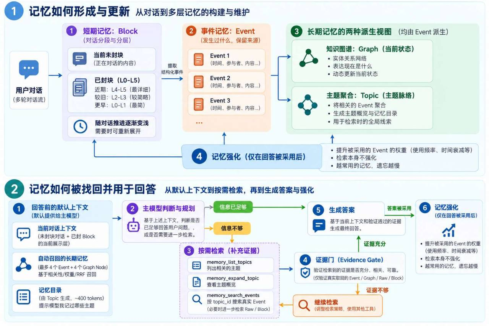
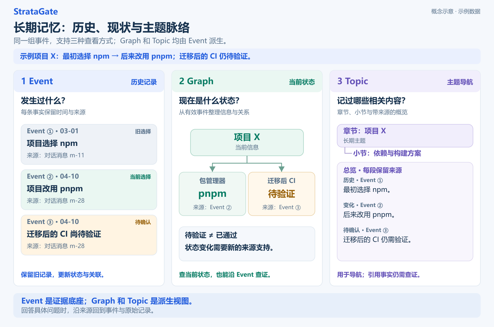

<div align="center">


# StrataGate

### 近期对话保留细节，远期记忆逐渐简化。

StrataGate 是 DeepSeek Harness 的跨会话记忆插件。近期对话保留细节，较早对话逐渐简化，需要时可以找回原文；重要信息整理为长期事件，知识图谱表达当前状态，主题目录帮助 Agent 了解记过哪些内容，并按需查找来源。

<p align="center">
  <a href="https://github.com/diqierjia/StrataGate-AgentMemory/actions/workflows/ci.yml"></a>
  <a href="https://www.npmjs.com/package/stratagate-dsh"></a>
  <a href="LICENSE"></a>
  <a href="https://github.com/diqierjia/StrataGate-AgentMemory/stargazers"></a>
</p>

[English](README.md) · [DeepSeek Harness 插件说明](docs/DSH.zh-CN.md) · [架构说明](docs/ARCHITECTURE.md) · [完整评测](docs/EVALUATION.md)

<strong>公开评测：</strong>在 LoCoMo 单个对话样本 `conv-26` 的 152 道题上，每个答案经过 10 次独立评审，平均判定正确率为 <strong>80.46%</strong>，Mem0 base 为 <strong>63.22%</strong>。这组结果对应 R8 评测配置。[查看评测范围](#experimental-results)。

</div>

---

<div align="center">

<h3 align="center">社区与下载</h3>

<table align="center">
  <tr>
    <td align="center">
      <a href="https://dshfind.com/zh/plugins/diqierjia/StrataGate-AgentMemory?ref=badge">
        
      </a>
    </td>
    <td align="center">
      <strong>npm 下载统计</strong><br /><br />
      <a href="https://www.npmjs.com/package/stratagate-dsh"></a><br />
      <a href="https://www.npmjs.com/package/stratagate-dsh"></a>
    </td>
  </tr>
</table>

<p align="center">
  <a href="https://awesome-dsh-plugin.com"></a>
  <a href="CONTRIBUTING.zh-CN.md"></a>
</p>

</div>

---

## 为什么选择 StrataGate？

1. **短期记忆：随对话推进逐渐模糊，需要时重新展开。**

   (1) **近期详细，远期简略。** 同一段对话保存为 L0–L5 六种详细程度的视图。随着后续对话积累，较早的记忆逐渐从完整对话变为关键事实、简短摘要和标题索引，减少历史内容对上下文的占用。→ [分层记忆](#layered-memory)

   (2) **展示变简，原始记录保留。** 完整的 L5 原始消息与工具记录始终保存。需要核对细节时，Agent 可以按需展开，找回当时的原话和上下文。→ [分层记忆](#layered-memory)

   

2. **长期记忆：事件保留历史，图谱整理现状，主题目录帮助查找。**

   (1) **事件记录“发生过什么”。** 对话中的重要决定、偏好、要求和变化会被提取为 Event，保留来源，并区分“什么时候提到”和“什么时候发生”，供后续会话查找和追溯。→ [事件卡](#event-cards)

   (2) **知识图谱表达“当前是什么状态”。** 根据历史事件，整理人物、项目、组织、工具和地点的当前信息及关系。新事件可以补充或取代旧状态，历史事件及其来源仍然保留。→ [当前状态图谱](#current-state-graph)

   (3) **主题目录说明“记过哪些内容”。** 相关事件按长期主题整理为章节和小节。Agent 可以先查看目录，再按需展开主题概览，了解背景、决定、变化和待确认事项，并沿来源查找具体事件。→ [记忆目录与主题概览](docs/MEMORY_TOPICS.zh-CN.md)

   (4) **长期权重也会衰减。** 随着对话推进，未被采用的记忆权重逐渐降低，影响检索与自动召回时的优先级；衰减后的记忆仍保留来源，可继续查证。→ [权重与采用强化](#use-only-reinforcement)

   (5) **支持迁移其他 AI 的记忆。** 导入内容可以转换为可追溯的事件，并用于更新知识图谱；原始导入内容仍会保留。→ [外部记忆导入](#external-memory-import)

3. **证据门：回答前先检查检索到的证据是否够用。**

   主题概览帮助定位内容，实际回答需要核对来源事件或原始记录。搜索结果相关，不代表足以回答当前问题。Agent 会判断证据是否充分；不足时继续搜索或展开，仍无法确认时明确说明不确定性。→ [证据门](#evidence-gate)

4. **检索命中不会自动强化记忆。**

   搜索命中、自动带入上下文和浏览主题目录都不会触发强化。在检索后的采用流程中，被记录为最终答案实际采用的 Event 才会增加采用计数、更新衰减起点；采用越多，之后衰减越慢。主动保存记忆时，确认重复的信息也可强化已有记录。→ [权重与采用强化](#use-only-reinforcement)

开始使用：→ [快速开始](#quick-start-deepseek-harness)

<a id="quick-start-deepseek-harness"></a>

## 快速开始：DeepSeek Harness

如果已经安装 DeepSeek Harness，请将 StrataGate 添加到你正在使用的 profile：

```bash
dsh plugin --profile web add stratagate-dsh
```

支持整个 DSH `0.2.0` 版本族：全部 Alpha、Beta、RC 和正式版（`>=0.2.0-0 <0.2.1-0`），同时保留此前支持的宿主版本。同属 `0.2.0` 的新版本无需因版本声明而等待插件更新。

重启该 profile，之后照常使用 DSH 即可。StrataGate 会自动记录主 Agent 已完成的对话，在后台生成可搜索的记忆，并在 **DSH 设置 → StrataGate-AgentMemory** 中提供记忆界面。

数据库默认保存在：

```text
DSH_HOME/stratagate/memory.db
```

移除插件不会删除数据库。截图、配置项、记忆工具和自动记录规则见 [DeepSeek Harness 插件中文说明](docs/DSH.zh-CN.md)。

上面的命令使用 `web` profile；如果使用其他 profile，请替换 `web`。开发者可直接查看[开发与文档](#code-entry-points)。

<a id="how-stratagate-works"></a>

## 它如何工作



图中展示的是答案采用后的 Event 强化流程；主动保存重复信息也可强化已有 Event。Block 展开改变的是展示层，目录与概览本身不作为强化证据。常驻画像单独提供，见[常驻画像说明](#persistent-profile)。

1. **保存对话。** 若干轮连续对话组成一个记忆块（Block），保存为从索引到原文的六种视图。旧 Block 默认展示的内容随对话推进逐渐变简，需要细节时可以重新展开。
2. **整理长期信息。** 有后续用途的事实、决定、偏好和要求被提取为事件（Event），保留时间、适用范围与来源。知识图谱据此整理当前状态，主题目录与概览把相关事件组织为章节和小节。
3. **回答时找回。** 插件默认提供当前对话、已设置的常驻画像、少量相关记忆和简短主题目录。信息不足时，Agent 可直接搜索事件、图谱或原文，也可先浏览目录、展开概览，再查找来源事件。
4. **检查证据并记录采用。** Agent 判断显式检索到的证据是否足以回答；不足时继续检索或展开，充分时据此回答，并记录实际采用的 Event，用于更新长期权重。

自动召回最多带入 **4 条 Event 和 4 个图谱节点**，预算约 **900 tokens**；主题目录另有约 **400 tokens** 的预算，内容较多时提供分类和分页入口。常驻画像、分层 Block 和尚未封存的对话分别提供，不包含在上述两项预算中。

目录和概览在后台用已有事件分批整理。读取已有目录或概览本身不调用模型、不生成证据批次，也不强化记忆。→ [记忆目录与主题概览](docs/MEMORY_TOPICS.zh-CN.md)

## 核心设计

| 机制 | 变化的内容 | 保留的内容 |
| --- | --- | --- |
| 短期记忆简化 | 旧 Block 默认使用哪个 L0–L5 视图 | L5 原始对话与工具记录 |
| 长期权重衰减 | Event 在后续召回中的优先级 | Event 历史及其来源 |

两者都随对话进度变化：短期按就绪 Block 距离计算，长期按对话轮次计算。放置几天本身不会触发这两种衰减。

<a id="layered-memory"></a>

### 1. 短期记忆：随对话推进逐渐简化，需要时重新展开

近期讨论通常需要保留完整细节，较早的对话则可以先以简短形式留在上下文中。StrataGate 为同一段对话保存多种详细程度的视图，并随着后续对话积累，逐渐减少旧对话默认呈现的内容。


**同一段对话，保存为六种详细程度。**

DeepSeek Harness 插件默认每 **6 轮**完整对话封存一个 Block，一轮指一次用户提问和助手的完整回复。封块大小可以配置；核心库默认值为 12 轮。尚未达到边界的内容继续保留在当前对话中。

每个完成处理的 Block 包含以下视图：

| 层级 | 保存的内容 | 主要用途 |
| --- | --- | --- |
| L0 | 标题和标签 | 用最少内容标识这段历史 |
| L1 | 简短摘要 | 快速了解讨论主题 |
| L2 | 关键事实 | 查看决定、约束、计划和结果 |
| L3 | 确定性精简对话 | 删除固定白名单中的独立寒暄或确认；重复的长段落与代码只保留第一次；工具调用保留名称和结果摘要 |
| L4 | 去除内部记录的近原文对话 | 过滤 system 消息；用户和助手正文只裁剪首尾空白并添加角色标签；可识别的工具记录保留名称和结果摘要 |
| L5 | 原始消息与工具记录 | 查证来源及具体细节 |

L0–L2 由模型概括；L3/L4 由固定规则生成：L3 删除独立寒暄和重复长文本，L4 则尽量保留原话；两者都会精简可识别的工具记录。具体规则见下方。短期衰减按后续就绪 Block 的数量推进，不按现实中经过的天数计算。

<details>
<summary>具体精简规则、衰减公式与层级阈值</summary>

L0–L2 由模型概括生成；L3、L4 不调用模型改写，而是由程序按以下固定规则生成：

- **L4：** 删除 system 消息；用户和助手正文只裁剪首尾空白并添加 `User`、`Assistant` 等角色标签。对于能够识别的结构化工具记录，只保留工具名称和最长 160 字符的结果摘要，省略原始 `arguments`、`params`、`input` 和 `request`；无法识别为工具 JSON 的 tool 正文保持原样。
- **L3：** 在不改写语义的前提下进一步精简。只有当整句去掉末尾标点后命中固定白名单时，才删除 `ok`、`thanks`、`好的`、`明白`、`收到`、`谢谢`、`可以` 等独立寒暄或确认。程序把连续空白合并并忽略大小写后，对代码型段落或至少 80 字符的长段落去重：第一次保留原文，之后的完全重复内容替换为省略标记。工具记录采用与 L4 相同的名称和结果摘要形式。
- **长度保护：** 如果生成的 L4 比 L5 更长，就直接使用 L5；如果 L3 比 L4 更长，就直接使用 L4，确保 `L3 ≤ L4 ≤ L5`。

原始记录先保存，摘要和事件处理随后进行。只有处理完成、进入就绪状态的 Block，才会替换对应的原生历史并参与衰减。

**后续对话越多，旧 Block 默认展示得越简略。**

Block 的展示变化由指数衰减控制：

<p align="center"><strong>w<sub>block</sub>(age) = e<sup>−λ<sub>block</sub> · age</sup></strong></p>

其中，衰减系数 λ<sub>block</sub> 默认取 **0.30**，程序根据权重区间选择当前展示层级。系数越小，详细内容保留得越久，相应占用的上下文也越多。

公式中的 `age` 按当前展示锚点与同一会话最新就绪 Block 之间的距离计算。它衡量的是对话积累的进度，**不是现实中经过的天数**。尚未封存的对话，以及仍在等待模型处理的 Block，都不会推动这项衰减。

例如，一个从 L5 开始、期间没有重新展开的 Block，在默认参数下会经历：

| 后续新增的就绪 Block 数量 | 默认展示层 |
| ---: | --- |
| 0–1 | L5 |
| 2 | L4 |
| 3–4 | L3 |
| 5–6 | L2 |
| 7–8 | L1 |
| 9 及以上 | L0 |

图中的层级变化用于展示趋势，实际变化由衰减参数和层级阈值共同决定，并非每新增一个 Block 就下降一级。

</details>

**需要细节时，可以重新展开。**

假设某段旧对话目前只显示：

> 讨论了项目技术方案与近期计划。

用户追问“当初为什么选择 pnpm”，Agent 可以展开关键事实、精简对话或完整原始记录，找到当时的原因。

展开既可以逐级进行，也可以直接指定更详细的层级。展开后，系统会以此次选定的层级和当前 Block 位置重新设置衰减起点；随着后续对话继续积累，它再逐渐变简。

因此，旧对话日常可以保持轻量，需要时仍能恢复细节。**L0–L4 都是原始记录的派生视图，不会覆盖 L5。**

<a id="event-cards"></a>

### 2. 长期记忆：事件保留历史，图谱整理现状，主题目录帮助查找

短期记忆保留讨论上下文，长期记忆把有后续用途的信息整理出来。下面用项目从 npm 改用 pnpm 的示例，说明三种视图如何分工：



**Event 记录发生过什么，Graph 整理当前状态，Topic 提供主题脉络和查找入口。** Graph 和 Topic 都从已有 Event 派生；具体结论仍需核对来源事件或原始记录。图中数据仅为示例。

**事件记录发生过什么，并保留时间和来源。**

同一个 Block 可以产生多条 Event，也可以没有需要提取的信息。每条事件保留内容、适用范围、来源 Block 和消息，以及能够确定的时间信息。

| 时间 | 表示什么 |
| --- | --- |
| 提及时间 | 这件事什么时候在对话中被说到 |
| 发生时间 | 事情实际发生或计划发生的时间 |

例如，用户在 5 月 6 日说“下周完成原型”，5 月 6 日是提及时间，“下周”描述的是计划完成时间。这条记录应保留计划性质，不能当作“原型已经完成”的证据。无法确定的时间保留原始表达和不确定性。

**新版提取规则更重视有后续用途的用户信息。**

用户的明确要求、纠正、评价和改变决定，只要具有独立用途，就可以成为事件候选；普通的读文件、运行工具和重复测试不会仅因发生过就逐项记录。已经确认的根因、平台限制、失败条件和重要结果仍可保留。

提取时需要明确适用范围：单次答复要求保留在会话范围，项目要求属于项目，稳定的用户信息或明确的长期指导才使用用户范围。例如，“这张图的箭头要对齐”不能自动扩大成永久审美偏好。范围缺失或不合法时，程序会有限重试，仍无法得到合法结果就不写入该次提取结果。

新规则用于升级后的正常提取，不会重放旧对话或统一改写已有事件。具体判断规则见[事件提取说明](docs/event-extractor.md)。

**新事件补充、取代或标记冲突，历史仍可追溯。**

项目先决定“使用 npm”，后来改为“使用 pnpm”，旧决定保留为历史，新事件更新当前选择。“迁移后的 CI 待验证”则补充一项待确认事项，不改变包管理器。如果两种说法互相矛盾、又无法确定哪条有效，就保留冲突供后续核实。

新事件不会覆盖旧事件的内容和来源，其有效状态和关系可以随新证据更新，便于回答“以前是什么样，后来发生了什么变化”。

<a id="current-state-graph"></a>

**知识图谱根据事件整理当前信息和关系。**

图谱用节点表示人物、项目、组织、工具和地点，用关系表示“使用”“参与”“依赖”等联系，属性和关系都保留来源 Event。在上述例子中：

- 问“项目现在用什么”，可以先查当前图谱；
- 问“什么时候改的”，可以查变更事件；
- 问“为什么改”，可以展开事件并回查原始讨论。

图谱中的状态必须有来源支持。图中的“使用 pnpm”来自 Event ②，“CI 待验证”来自 Event ③；待验证不能当作已通过。只有新证据确认结果后，才更新相应状态。图谱更新失败时可以单独重试，已保存的事件和原文仍可查找。

<a id="memory-topics"></a>

**主题目录帮助 Agent 知道有哪些记忆，再找到具体来源。**

知道关键词时，可以直接检索；只记得大概聊过某件事时，可以先看目录。一个 Topic 对应长期章节，例如图中的“项目 X”；章内小节容纳持续相关的事项，例如“依赖与构建”。具体版本、bug 和处理进度放在小节内部，避免每次变化都新建章节。

目录提供主题名称和入口，按需展开的概览整理背景、进展、决定、变化和待确认问题，并保留事件来源。同名内容归入同一节，新增内容时尽量保持已有章节和小节的编号稳定。

例如，用户问“之前项目技术方案讨论到哪了”，Agent 可以先找到相应主题，查看概览，再检索来源事件，核对已经确定的方案、后续变更和待决定问题。

**概览用于导航，回答依据仍需从来源取得。** 浏览目录和概览不产生证据批次、不强化记忆；需要引用事实时，再检索事件或展开来源，并完成证据检查。目录未整理好时，普通事件、图谱和原文检索仍可使用。

工具与后台整理细节见[记忆目录与主题整合](docs/MEMORY_TOPICS.zh-CN.md)。

<a id="persistent-profile"></a>

**常驻画像、长期事件和当前要求分别保存。**

| 用户表达 | 保存位置 | 什么时候使用 |
| --- | --- | --- |
| “以后默认用中文回答” | 常驻画像 Profile | 设置后跨会话自动提供 |
| “这个项目已经改用 pnpm” | 长期事件 Event | 在相关问题中召回或检索 |
| “这次回答简短一点” | 当前对话 | 用于本次回答，无需写入长期记忆 |

“记住”一词本身不决定保存位置。明确的画像更新请求可以直接应用；由 Agent 推断的画像变化需要先说明拟修改的字段与内容，并取得用户同意。适合在相关情境中想起的信息，也可以通过主动记忆工具保存，不必等待对话封块。

地点画像区分默认地点、常驻城市和当前城市。例如，常住哈尔滨、目前出差北京时，问天气会优先使用本次明确指定的地点；没有指定时参考当前城市，再参考默认地点。出差不会自动覆盖常驻城市，当前城市跨会话保留到用户修改或清空。使用说明见[插件指南](docs/DSH.zh-CN.md)。

<a id="evidence-gate"></a>

### 3. 证据门：检查检索结果是否足以回答当前问题

找到相关记忆后，Agent 还需要判断它是否支持当前答案：证据够不够，还缺什么，应该直接回答还是继续查找。检索排序和记忆权重都不能当作事实正确率。

例如，用户问“为什么当初改用了 pnpm”：

| 步骤 | 找到的内容 | 应如何处理 |
| --- | --- | --- |
| 找到主题 | “项目技术选型”的概览提到换了包管理器 | 沿来源查找具体事件 |
| 检索事件 | “项目已从 npm 改为 pnpm” | 只能确认变更，原因仍缺失，继续展开 |
| 核对原文 | 示例原话：“安装更快，也更适合我们的多包结构” | 核对适用项目和时间后，按这段证据解释原因 |

这里的原话是演示用例。若来源没有说明原因，Agent 应明确无法确认，不能根据 pnpm 的一般优点推测当时的决定。

证据是否充分由模型判断，程序检查来源引用和检索流程。主题概览只提供导航线索；实际采用仍需来自经过检查的检索证据。已有上下文足以回答时，不必为了流程额外搜索。

显式检索批次在最终回答前需要完成证据评估和采用记录；未使用的批次也要记录为空采用。遗漏时，插件会先要求完成收尾，再生成完整的用户答案，避免以内部状态说明结束回复。模型仍可能误判证据，无法核实时应保留不确定性。

<details>
<summary>证据评估字段与流程检查</summary>

| 评估项 | 需要说明的内容 |
| --- | --- |
| `verdict` | 证据充分、部分充分，还是与问题不符 |
| `evidence_refs` | 哪些检索结果支持当前判断 |
| `fit` | 证据与问题具体匹配在哪里 |
| `missing` | 还缺少哪些信息 |
| `next_strategy` | 直接回答，还是继续搜索或展开 |

引用必须来自指定检索批次；接受 `sufficient` 时，需要有效证据引用，并明确选择回答。采用记录只包含实际用于答案的证据，没有采用则提交空列表。接口说明见[插件指南](docs/DSH.zh-CN.md)。

</details>

<a id="use-only-reinforcement"></a>

### 4. 检索命中不会自动强化记忆：采用越多，之后衰减越慢

长期记忆也会随对话推进而衰减。这里变化的是 Event 的权重，它参与后续召回和排序；与短期 Block 不同，Event 不会因此逐级切换 L0–L5 展示层。


未被用于答案的 Event 权重随对话轮次逐渐降低，可能影响后续召回的排序，但历史记录仍然保留。

**被搜索到，不会触发强化。**

检索命中只说明一条记忆可能相关。系统可以记录它何时被检索，但不会因此增加采用计数，也不会重置衰减起点。

自动带入上下文、浏览主题目录和展开概览，同样不会因为内容被展示而强化记忆。这样可以避免某条记忆仅因偶然排在前面，就通过反复出现不断提高自身权重。

**检索后的实际采用会更新权重。**

Agent 确定用于最终回答的证据后，会提交采用回执。通过检查的 Event 增加采用计数，并把衰减起点更新到当前轮次。对于未被额外限制权重的普通活跃事件，此时权重回到 1。

随着采用计数增加，公式中的衰减系数变小，同样经过一段对话后，它能保留更高的权重。因此，反复帮助回答的记忆会逐渐衰减得更慢。

采用依据来自 Agent 提交的证据选择。程序检查证据是否属于对应批次、是否经过充分性评估，并通过回执避免同一次操作被重复执行；没有使用的检索结果不获得这次强化。

**主动保存重复信息，也可以强化已有记录。**

使用 `memory_remember` 主动保存信息时，程序确认与已有主动记忆完全或近似重复，可强化已有事件，而无需再创建一张重复卡片。这属于写入时的重复处理，与搜索命中不同。

**不同重要程度的记忆，可以保留不同的最低权重。**

| 记忆类别 | 默认最低权重 |
| --- | ---: |
| 普通信息 | 0 |
| 用户偏好 | 0.3 |
| 身份信息 | 0.9 |
| 安全信息 | 1.0 |

此外，置顶记忆的有效权重保持为 1；被取代的事件通常设置较低的权重上限，避免旧状态持续占据较高优先级。

这些权重表达的是记忆管理策略，不能当作事实正确率。权重较高的信息仍需要结合当前问题、最新状态和原始来源进行判断。

<details>
<summary>长期权重公式与计数含义</summary>

**新事件具有初始权重，未被采用时逐渐衰减。**

长期 Event 的基础权重函数为：

<p align="center"><strong>w(t,n) = max(floor, e<sup>−λ(n)t</sup>)</strong></p>

<p align="center"><strong>λ(n) = 0.15 / (1 + 1.5 ln(n))</strong></p>

其中：

- `t` 是当前轮次与最近一次强化锚点的差，新事件从创建时开始计算；
- `n` 是内部计数，初始化为 1；答案采用或主动记忆重复确认时增加，单纯检索不增加；
- `floor` 是根据记忆重要程度设置的最低权重。

长期权重衰减同样按对话轮次计算，而不是按现实时间计算。较低的权重可能降低一条记忆在后续召回中的优先级，但不会因衰减而删除它的历史记录。

</details>

<a id="external-memory-import"></a>

## 外部 AI 记忆迁移

可以导入其他 AI 导出的记忆总结。StrataGate 将重要信息整理为 Event，与已有记忆比较，并保留原始导入内容供追溯。

DSH 管理界面提供导入预览：重复内容可以忽略，变化可以新增、合并或取代旧状态，不确定的关系可以标为冲突。低置信度项可人工选择处理方式，提交后可按批次撤销。旧事件及其来源仍会保留。

导出格式、提示词与接入示例见[外部记忆导入说明](docs/EXTERNAL_MEMORY_IMPORT.zh-CN.md)。

## 一次真实的检索

LoCoMo 中有一道题询问 Caroline 在什么时候进行了学校演讲。检索过程是：

1. 搜索事件，找到“学校演讲”事件卡，但没有具体日期。
2. Agent 判断证据部分充分，指出缺少发生日期，继续检索原始消息。
3. 找到 2023-06-09 的消息，其中写着“last week”。
4. 结合消息时间理解“上周”，得到足够的时间依据后回答。

事件卡帮助定位，原始消息和时间戳帮助核对；证据门要求 Agent 识别缺口，继续查证。

<a id="实验结果"></a>
<a id="experimental-results"></a>

## 评测结果与边界

仓库公开的 R8 对比评测使用 LoCoMo 中的 `conv-26` 对话样本，包含 **419 条消息、35 个会话和 152 道问题**，覆盖 category 1–4。

**以下成绩对应公开的 R8 实验配置，不是 0.3.0 主题目录或 0.3.2 新版事件提取的专项评测。** 不能据此推断这些更新的准确率、成本变化或独立收益。

两个系统分别生成答案，再对每道题的答案进行 **10 次独立 Judge 评审**。这里的十次指评审重复次数，不代表十次完整系统运行。

| 指标 | StrataGate | Mem0 base | 差值 |
| --- | ---: | ---: | ---: |
| 10 次评审平均准确率 | **80.46%** | 63.22% | **+17.24 个百分点** |
| 多数票正确 | **121 / 152（79.61%）** | 96 / 152（63.16%） | **+25 题** |
| 时间类问题（Temporal） | **74.86%** | 34.59% | **+40.27 个百分点** |
| 单跳问题（Single-hop） | **89.29%** | 75.14% | **+14.14 个百分点** |
| 多跳问题（Multi-hop） | **66.56%** | 61.56% | +5.00 个百分点 |
| 开放域问题（Open-domain） | 83.08% | **84.62%** | -1.54 个百分点 |

两边使用相同的问题、顺序、答案模型、Judge 模型、评审提示词、解析器和评审次数，并分别重新构建记忆。记忆抽取、检索实现、embedding 使用方式和回答上下文存在差异，因此这里比较的是两套完整系统配置。

这组结果仅覆盖 `conv-26`，不代表完整 LoCoMo 成绩，也不能单独证明短期记忆衰减、知识图谱或证据门中某一项机制带来的收益。各组件的独立作用仍需通过消融实验检验。

完整协议、逐题结果及评审波动见 [评测文档](docs/EVALUATION.md)，汇总数据见 [机器可读评测结果](benchmarks/locomo-conv26-r8-final.json)。

上述 R8 评测中，仍有 **31 道题被多数评审判为错误**。按可观察到的失败阶段划分：

| 失败阶段 | 题数 | 反映的问题 |
| --- | ---: | --- |
| 未发起检索，直接回答错误 | 15 | Agent 有时未意识到需要查找历史证据 |
| 证据被判为充分，最终答案仍然错误 | 14 | 证据可能属于相邻事件，或不足以支持完整答案 |
| 达到检索预算时，证据仍不充分 | 2 | 在给定预算内没有找到足够的信息 |

这些结果说明，在该评测范围内，仍需改进何时发起检索，以及如何判断证据是否真正回答了问题。证据门能够约束引用和评估流程，但不能保证模型的语义判断或最终答案一定正确。

R1–R8 的设计演变、逐题分析与后续验证方向见[完整评测](docs/EVALUATION.md)。

## 使用范围与成本

**记忆空间决定哪些对话共享记忆。** DSH 默认按项目工作目录隔离；也可按会话隔离，或使用全局共享空间。主题目录只展示当前空间内可见的事件，常驻画像则跨会话、跨记忆空间提供。配置方式见[插件指南](docs/DSH.zh-CN.md)。

**回答时的上下文预算，不等于全部模型开销。** 自动召回和主题目录各有预算，常驻画像、分层 Block、当前未封存对话及后续主动检索另行提供。900 tokens 和 400 tokens 分别是相关记忆与目录的预算，不能相加后当作整个请求的固定大小。

| 环节 | 是否调用模型 | 成本来自哪里 |
| --- | --- | --- |
| 后台摘要、事件提取、图谱、主题与画像整理 | 会 | 对话、事件或画像输入、生成结果，以及有限重试 |
| 读取已有目录、概览或搜索已有记录 | 读取本身不调用模型 | 结果带入后续模型上下文时仍占 tokens |
| Agent 判断证据并生成答案 | 会 | 当前上下文、取回的证据和答案生成 |

分层视图减少的是回答时默认带入的历史内容。后台处理工具密集型对话时，会精简代码和过长工具记录的模型输入；完整记录仍保留在 L5。总费用需要结合后台处理、检索和回答的实际用量评估，不能由上下文变短直接推断。

**升级后，历史目录逐步形成。** 已有事件在后台分批整理，目录可能暂时不完整；新增或变化的事件优先处理。失败或待整理的内容仍有事件入口，普通检索继续可用。历史整理有全库共享额度、有限重试和重启恢复，不承诺固定金额；额度与恢复细节见[主题整理说明](docs/MEMORY_TOPICS.zh-CN.md)。

目录与概览可根据有效来源重建。来源被修改、遗忘或归档后，过期派生内容先隐藏，再后台重建。新版事件提取规则用于后续正常提取，不统一重写旧事件。功能测试检查这些流程与约束，实际提取、归类和证据判断仍取决于模型。

<a id="代码入口"></a>
<a id="code-entry-points"></a>

## 开发与文档

本节面向开发者。直接使用 DeepSeek Harness 插件的用户，可以按照 [快速开始](#quick-start-deepseek-harness)安装，无需自行构建仓库。

开发环境需要：

- Node.js **22.19.0 及以上的 22.x 版本**，或 **24.0.0 及以上版本**；
- 对应的版本声明为 `^22.19.0 || >=24.0.0`。

检出仓库后，在仓库根目录运行：

```bash
npm install
npm run check
npm test
npm run build
```

| 资源 | 内容 |
| --- | --- |
| [DeepSeek Harness 使用说明](docs/DSH.zh-CN.md) | 安装、配置、界面、记忆工具和恢复机制 |
| [记忆目录与主题概览](docs/MEMORY_TOPICS.zh-CN.md) | 章节与小节、来源追溯、后台整理、预算和恢复 |
| [事件提取规则](docs/event-extractor.md) | 提取判断、适用范围、重复与历史关系，以及兼容边界 |
| [架构文档](docs/ARCHITECTURE.md) | 分层规则、事件与图谱、检索、证据门、权重、存储和核心 API |
| [外部记忆导入](docs/EXTERNAL_MEMORY_IMPORT.zh-CN.md) | 导出格式、导入流程和接入示例 |
| [完整评测](docs/EVALUATION.md) | 实验协议、版本演变、失败分析和结果范围 |
| [评测汇总数据](benchmarks/locomo-conv26-r8-final.json) | 已公开运行的结果、统计和产物信息 |
| [核心引擎示例](packages/core/examples/basic.ts) | 最小 API 接入示例 |

核心实现位于 `packages/core/`，DSH 适配层位于 `src/`。分层规则见 [blocks.ts](packages/core/src/blocks.ts)，长期权重见 [weights.ts](packages/core/src/weights.ts)。

核心 API 接入、持久化及采用回执的幂等处理见[架构说明](docs/ARCHITECTURE.md)，最小用法见[核心引擎示例](packages/core/examples/basic.ts)。

## 参与贡献

欢迎各种形式的贡献：修复问题、完善文档、增加集成，或探索更好的记忆与检索方案都可以。

请先阅读 [`CONTRIBUTING.zh-CN.md`](CONTRIBUTING.zh-CN.md)，其中包含 monorepo 开发环境、检查与测试命令、适合参与的方向，以及提交 Pull Request 的建议。如果还不确定一个想法是否适合项目，建议先[创建 Issue](https://github.com/diqierjia/StrataGate-AgentMemory/issues)，再投入较大的改动。

## 贡献者

<a href="https://github.com/diqierjia/StrataGate-AgentMemory/graphs/contributors">
  
</a>

## 许可证

StrataGate 使用 [MIT License](LICENSE)。
